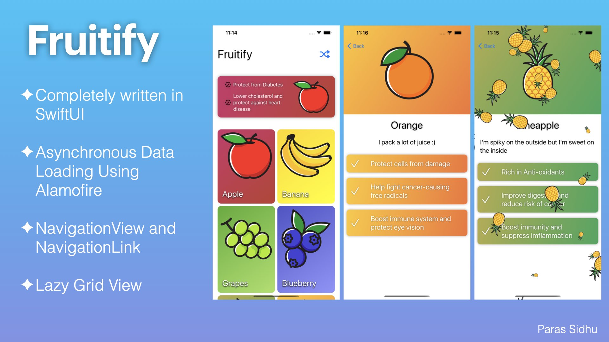

# Fruitify
 A SwiftUI application demonstrating asynchronous data loading, image loading, animations, navigation and a lot of UI stuff. This is my learning project and if you are new to SwiftUI, it can be a good project to understand basic concepts practically.

### **Star :star:  this repo to show your support and it really does matter!** :clap:

# Concepts Used

- Asynchronous data loading using Alamofire
- Asynchronous image loading using URLImage
- Animations including confetti view (Thanks to <a href="https://www.youtube.com/c/Kavsoft/videos">Kavsoft</a>)
- Navigation between different screens
- LazyVGrid to lazily load items when visible on the screen and thus improve performance
- Combining small views to form a larger view equivalent to a screen

Thanks to <a href="https://www.vecteezy.com/">Vecteezy</a> for the icons.

# License

MIT License

Copyright (c) 2021 Paras Sidhu

Permission is hereby granted, free of charge, to any person obtaining a copy
of this software and associated documentation files (the "Software"), to deal
in the Software without restriction, including without limitation the rights
to use, copy, modify, merge, publish, distribute, sublicense, and/or sell
copies of the Software, and to permit persons to whom the Software is
furnished to do so, subject to the following conditions:

The above copyright notice and this permission notice shall be included in all
copies or substantial portions of the Software.

THE SOFTWARE IS PROVIDED "AS IS", WITHOUT WARRANTY OF ANY KIND, EXPRESS OR
IMPLIED, INCLUDING BUT NOT LIMITED TO THE WARRANTIES OF MERCHANTABILITY,
FITNESS FOR A PARTICULAR PURPOSE AND NONINFRINGEMENT. IN NO EVENT SHALL THE
AUTHORS OR COPYRIGHT HOLDERS BE LIABLE FOR ANY CLAIM, DAMAGES OR OTHER
LIABILITY, WHETHER IN AN ACTION OF CONTRACT, TORT OR OTHERWISE, ARISING FROM,
OUT OF OR IN CONNECTION WITH THE SOFTWARE OR THE USE OR OTHER DEALINGS IN THE
SOFTWARE.
